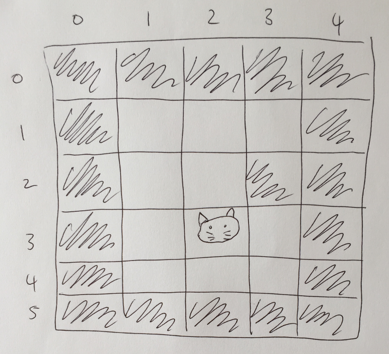

## Draw a grid

No matter who you are, instructor or student, your or old, take out a piece of paper and a pen or pencil and draw a grid, try keep it under 20 tiles wide or high so that you can easily draw in each tile.

Don't worry about making it perfect, don't even use a ruler, free hand it, get it on paper as quickly as you can.

## Add co-ordinates

Once you have your grid on paper write down numbers above the top row of tiles, starting at 0 above the very top left tile and counting up one at a time to the last tile in the top row. The last number on the right should be `w-1` where `w` is the number of tiles wide your grid is.

Now do the same along the left side of the grid. The last number on the bottom should be `h-1` where `h` is the number of tiles heigh your grid is.

## Add walls

Now let's add some things to our grid world. Shade in the top left tile `(x:0, y:0)`. A shaded in tile will represent a wall in our game world. Now shade in the tile to the right of that one `(x:1, y:0)` and continue shading anll the other tiles in that row until you get to `(x:w-1, y:0)`. The very top row of your grid is now wall tiles.

Let's fill the bottom row and left and right columns with wall tiles too to surround our world with walls.

Now that we have the world's boundary defined place walls in the interior to create a maze or rooms. Makse sure to leave some empty tiles around the walls so we can fill them in with other things in our game.

## Add the player

Lastly draw something you would like to use to represent your player in an empty tile. I drew a kitten.

### The result

Here's my simple grid, its quite small so I couldn't get creative with mazes or rooms. If you want to make another grid go ahead and do so, keep this one though as your game can have multiple rooms in it.

#### Instructor notes:

- Try and stress that students don't need to make their drawings perfect.
- I'd recommned not using rulers or erasers for this task.
- If you make a mistake in a cell, just shade it in to make it a wall.
