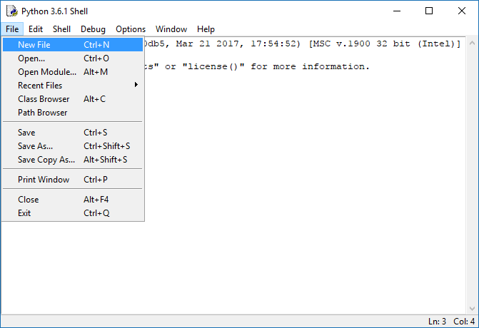

Now that we have drawn a game world on paper let's make it digital by recreating it in a text file. To do this you need to one character symbol to represent each different type of tile eg.

- A wall tile on the paper will be represented by a `#` in the text file
- The player will be represented by a `@`
- An empty tile a ` `

Open Python IDLE or your code editor of choice and create a new file and save it as `world.txt`.



Using the mapping you created, recreate your paper world in it like I have below. Make sure you use one character and don't surround it with any additional spaces.

<div class="path">
  <a href="https://github.com/seanpackham/python-pyglet-course/_lessons/5/text-world/world.txt">lessons/5/text-world/world.txt</a>
</div>
```
#####
#   #
#  ##
# @ #
#   #
#####
```

Make sure your map begins on the first line, each row has the same number of characters (tiles) and there is no more than one empty line at the end (some text editors always ensure there is an empty line at the end of a file when saving it).

## Rows

The tiles in each row run from left to right but you count the number of rows from top to bottom. So I have 6 rows each with 5 tiles in.

```
#####
```

## Columns

The tiles in each column run from top to bottom but you count the number of columns from left to right. So I have 5 colmuns each with 6 tiles in.

```
#
#
#
#
#
#
```
