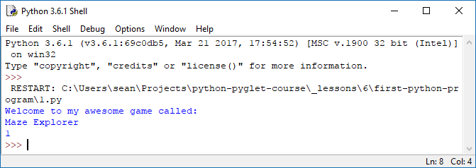
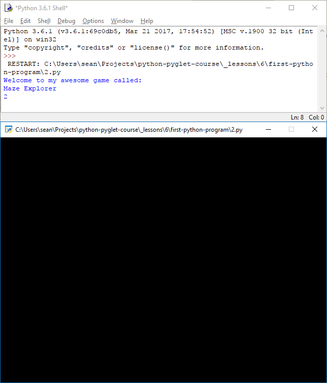
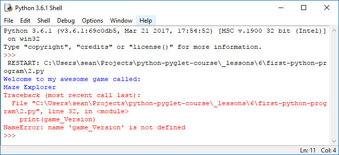

You've planned and draw your world on paper, created a file format to represent tiles digitally, now in this lesson you are going to write your first Python program that will output some content and display the game's main window.

## Variables and `print()`

Create a new file Python file called `1.py` and paste the following code into it, save it and run it by pressing `F5`.

<div class="path">
  <a href="https://github.com/SeanPackham/python-pyglet-course/blob/master/_lessons/6/first-python-program/1.py" target="_blank">lessons/6/first-ppython-program/1.py</a>
</div>
```python
# lines beginning with a "#" are comments
# comments help us document our code
# but do nothing when the program runs

# we are using the Python programming language
# and the pyglet gaming module
# which we need to import into our program
import pyglet

# let's give our game a name
# and store it in a  variable called "game_name"
# it's called a variable because the value can "vary"
game_name = 'Maze Explorer'

# variables can store numbers, text (strings), dates
# and more complex types like files or a game window
# this is the first version of our game
# let's store that number in a variable too
game_version = 1

# programs run 1 line at a time
# from the top of the file to the bottom
# this line will be printed to the screen first
print('Welcome to my awesome game called:')

# followed by the contents of the "game_name" variable
print(game_name)

# lastly the contents of the "game_version"
print(game_version)

# there are no more lines to run so the program will end
```

Our program isn't doing anything exciting at this point, all it does is output three lines.



## Pyglet Window

Let's make it open a blank window we will use to draw our game world. I only included the changed lines below but the linked file has the entire updated program.

<div class="path">
  <a href="https://github.com/SeanPackham/python-pyglet-course/blob/master/_lessons/6/first-python-program/2.py" target="_blank">lessons/6/first-ppython-program/2.py</a>
</div>
```python
# since we are making a change to our game
# let's bump the version up by 1
game_version = 2

...

# and replace the last comment about "no more lines to run"
# with this line to create a game window
window = pyglet.window.Window()

# and this line to run the game
# now the program won't exit until the pyglet game window is closed
pyglet.app.run()
```

When we run the updated program we can see our version number is now `2` and a blank game window opens. Closing the window exits the program.



## Debugging

If some of the things seem a little confusing, try changing the order of the statements and the variables' names and contents to see how things are affected.

When Python doesn't understand the code you have written it will display an error. Some of the most common errors you will make as a beginner:

- Varialbe names
- String quotations
- Execution order
- Indentation

### Variable names

Python variable names are case sensitive `game_name` is not the same as `Game_Name`, `GAME_NAME` or any other variation. Variable names can only contain letters, numbers and underscores. To increase the readability of multi-word variables, separate each word with an underscore.

Try changing your program's variable names and intentionally introduce errors, for example I changed one of my program's lines to:

```python
# lastly the contents of the "game_version"
# Introduce an error by using an unknown variable name
# by capitalised V of version
print(game_Version)
```

Which makes Python throw the following error:


